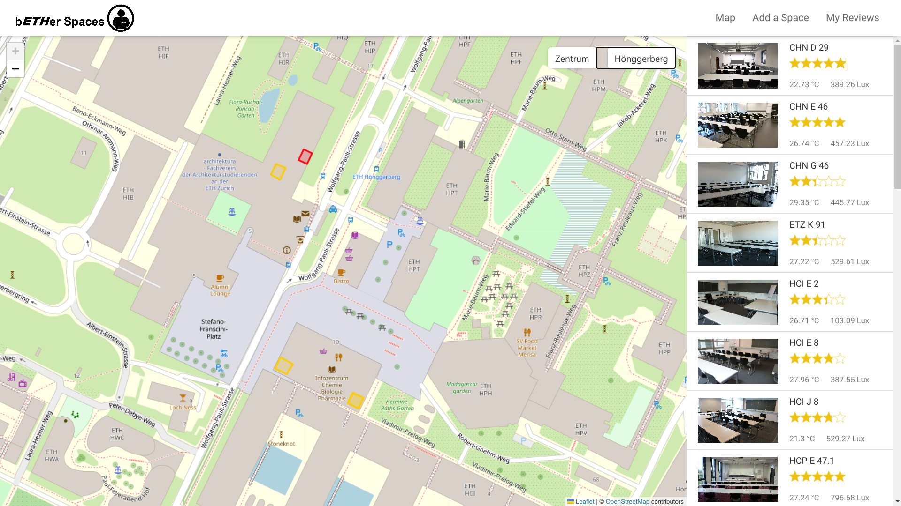
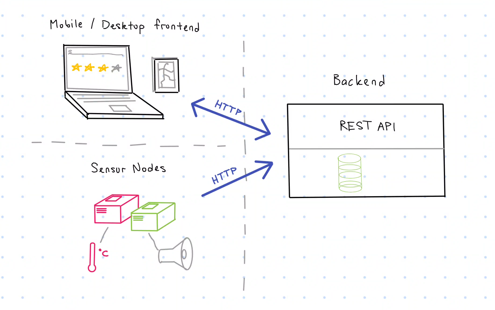

> Empowering students with healthy spaces.

With bETHer spaces we aim to provide an easy to use tool for students to find ideal student learning spaces.
We use the data provided by Enviro+ sensors to feed an API with environmental information about study spaces.
A user can use this data to find a study space that matches their exact environmental preferences.
Lastly, our application allows users to review existing spaces and add new spaces to share their favourite spots with other users.

## 🚀 Getting Started
|          [Website](https://spaces.tenderribs.cc)           |                                             Overview                                             |
| :--------------------------------------------------------: | :----------------------------------------------------------------------------------------------: |
|  |  |

- [Frontend Documentation](./docs/frontend.md)
- [Backend Documentation](./docs/backend.md)
- [Sensor Nodes Documentation](./docs/SensorNodes.md)

## REST-API

Use our data to kickstart your own project using the following endpoints!

- [`spaces`](https://bether.tenderribs.cc/api/spaces)
- [`measurements`](https://bether.tenderribs.cc/api/measurements)
- [`ratings`](https://bether.tenderribs.cc/api/ratings)
