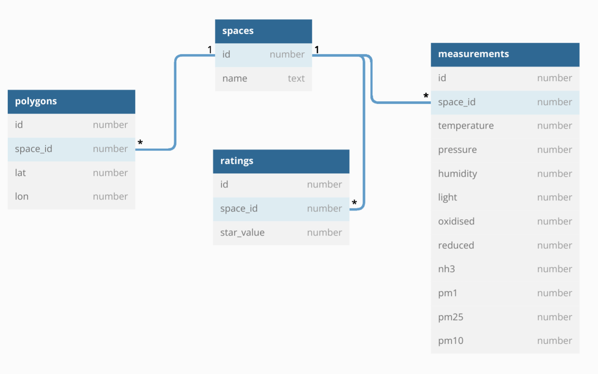

# bETHer spaces

> Empowering students with healthy spaces.

## 🚀 Getting Started
|                                                App Screenshot                                                 |                                        Overview                                        |
| :-----------------------------------------------------------------------------------------------------------: | :------------------------------------------------------------------------------------: |
|  |  |

- [Frontend Documentation](./docs/frontend.md)
- [Backend Documentation](./docs/backend.md)
- [Sensor Nodes Documentation](./docs/SensorNodes.md)

## REST-API

Use our data to kickstart your own project using the following endpoints!

- [`spaces`](https://bether.tenderribs.cc/api/spaces)
- [`measurements`](https://bether.tenderribs.cc/api/measurements)
- [`ratings`](https://bether.tenderribs.cc/api/ratings)
